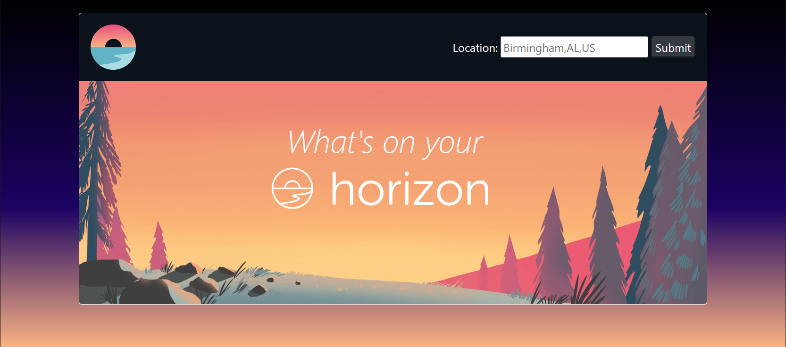
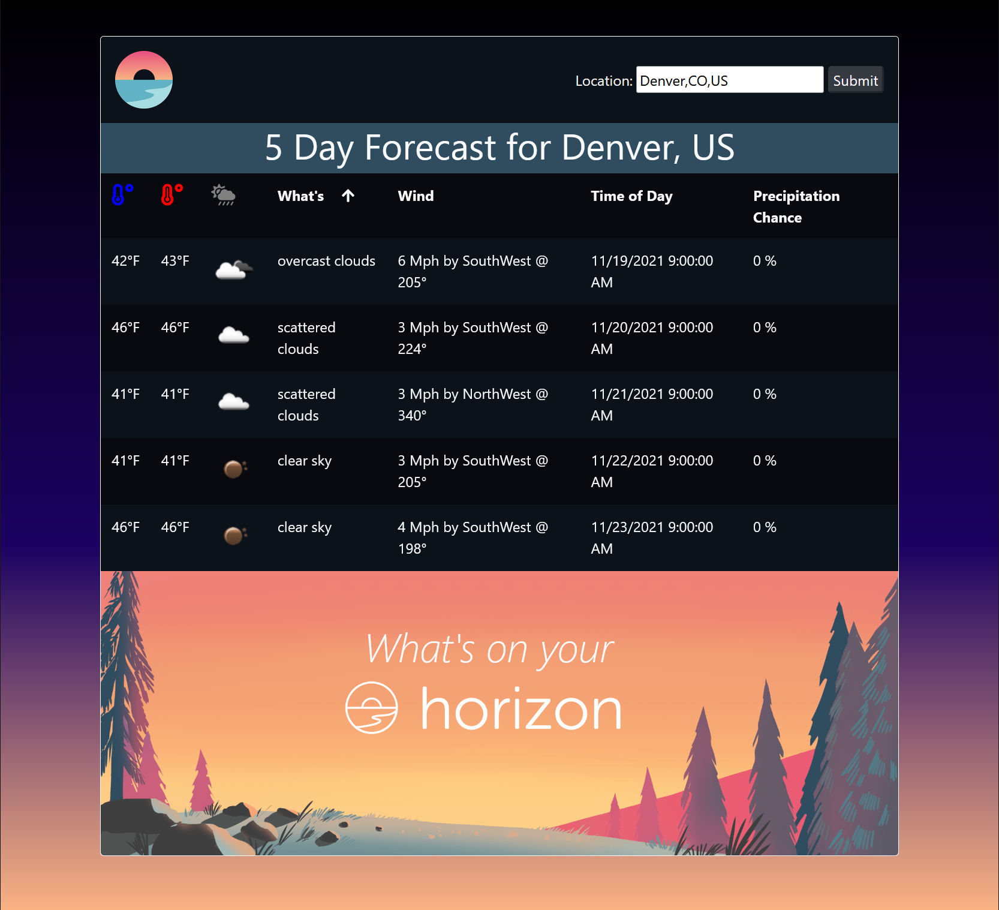

# Horizon

### What's _actually_ working

- Forms now correctly pass data from user input back to controller and return view with correct data.
- Looping through list of data from JSON and display to view

### TODO's:

- [x] Abstract API Key away
  - Done! Huzzah!
- [x] Implement changes in controller for different weather forecasts
  - Done! Successfully passing data from controller to view
- [x] Refine styling via CSS
    - Calling this *partially* done...
- [ ] Implement exception handling for WindDirection and CardinalDirection in HomeController
- [ ] Implement exception handling for user input on Index page
- [x] Add Speed property to ExtendedWeather.cs
- [x] Add Precipitiation property to ExtendedWeather.cs

